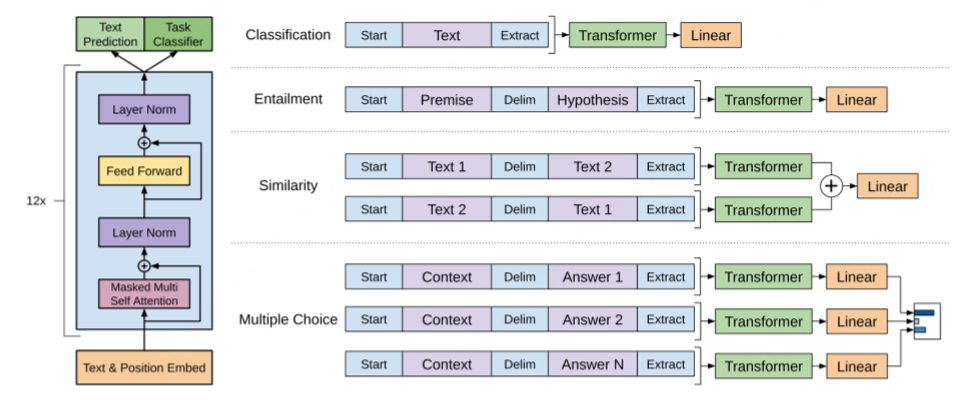
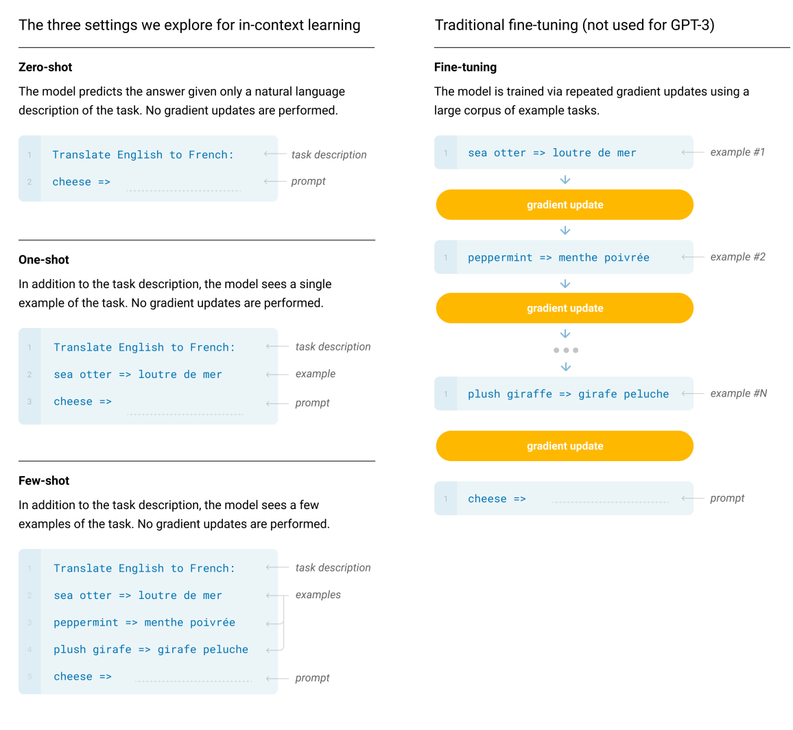
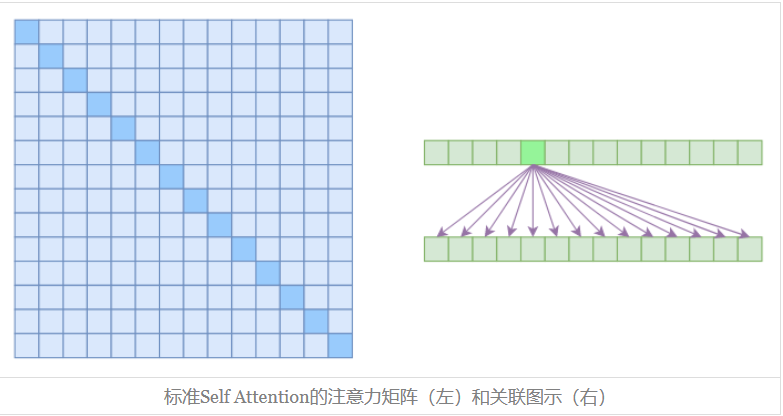
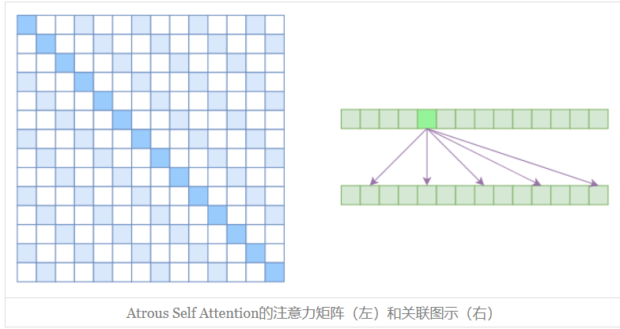
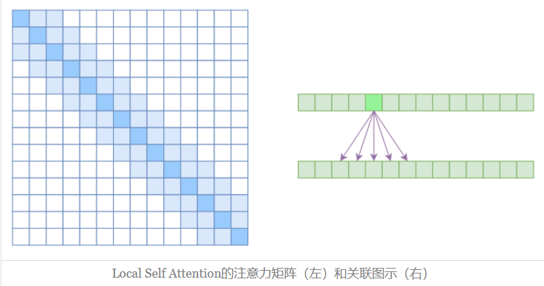
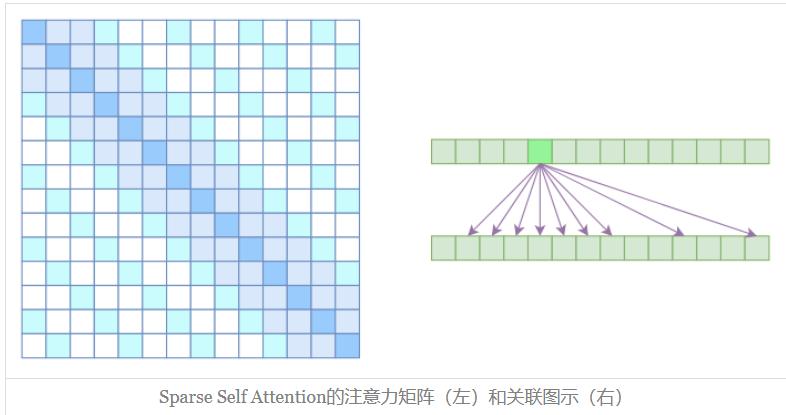
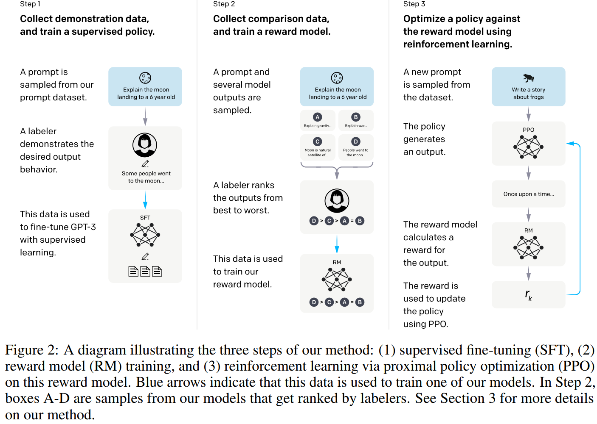
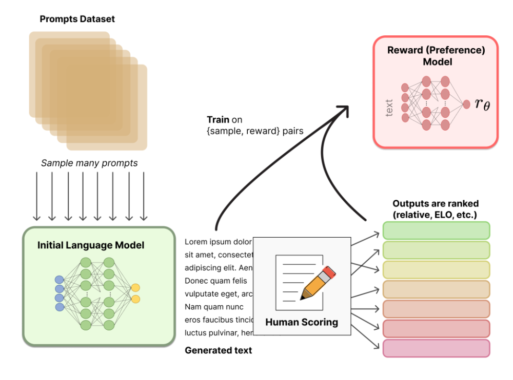

## 关于 Language Model 的综述报告

### 1. 语言模型

语言模型（Language Model, LM）是用于**建模自然语言的概率模型**，简单来说，其任务就是评估一个给定的词序列（即一个句子）在真实世界中出现的概率，或者说，**对于任意的词序列，这个模型能够计算出这个序列是一句话的概率。**

给定一个词表 $V$，**LM** 应当能计算出任意单词序列 $w_1, w_2, ..., w_n$ 是一句话的概率 

$$
p(w_1, w_2, ..., w_n)
$$


而该公式也可以写成

$$
\begin{align}
p(w_1, w_2, ..., w_n) &= p(w_1) \cdot p(w_2|w_1) \cdot p(w_3|w_1,w_2) ... p(w_n|w_2,...,w_{n-1}) \\
                      &= p(w_1) \prod_{i=2}^{n} p(w_i|w_1, ..., w_{i-1})
\end{align}
$$


如果模型能够有效地计算每一个 $p(w_i|w_1, ..., w_{i-1})$，即**当前单词在前面所有单词条件下**出现的概率，那么它就能够轻松地计算出整个词序列的概率 $p(w_1, w_2, ..., w_n)$，因此，语言模型也常被描述为能够计算 $p(w_i|w_1, ..., w_{i-1})$ 的模型。

从文本生成的角度来看，语言模型可以被定义为：给定一个短语（可以是一个词组或一句话），语言模型能够预测下一个最有可能出现的词。这意味着，语言模型不仅能够评估句子的概率，还可以用于生成连贯的文本。

### 2. N-gram 模型

在语言模型的框架下，**N-gram 语言模型** 是一种基于统计的方法，用于预测序列中下一个词的出现概率。N-gram 模型通过考察前面 **N−1**个词来预测当前词，从而简化了语言模型的复杂性

**N-gram** 指的是序列中的 N 个连续词汇。根据 **N** 的不同，N-gram 模型可以分为：

- **Unigram（1-gram）**：仅考虑当前词的概率，不依赖任何上下文。
- **Bigram（2-gram）**：考虑当前词及其前一个词的条件概率（一阶马尔可夫）。
- **Trigram（3-gram）**：考虑当前词及其前两个词的条件概率（二阶马尔可夫）。
- ......

N-gram 模型的核心思想是利用**（N阶）马尔可夫假设**（这里的N与N-gram的N不同（相差1）），即假设当前词的出现**仅依赖于前面有限个（N）词**。具体来说，N 阶马尔可夫假设每个词仅依赖前 N 个词时：

$$
p(w_i∣w_1,w_2,…,w_{i−1}) \approx p(w_i∣w_{i−N},…,w_{i−1})
$$


因此，整个词序列的联合概率可以近似表示为：

$$
p(w_1,w_2,...,w_n) \approx p(w_1)...p(w_N|w_{N-1},...,w_{1}) \prod_{i=N+1}^{n}p(w_i|w_{i-N},...,w_{i-1})
$$

#### 2.1. N-gram 模型的构建
##### a. 词表构建
首先，需要确定词表 $V$ 的大小,通常会对语料库进行预处理，包括分词、去停用词、低频词替换（如用 `<UNK>` 表示未知词）等，以控制词表的规模。
##### b. 计数统计
统计语料库中所有可能的 N-gram 出现次数。具体来说：
- 对于每一个 $N$-gram $(w_{i-(N-1)}, \ldots, w_i)$，统计其出现次数 $C(w_{i-(N-1)}, \ldots, w_i)$
- 同时，统计 $(N-1)$-gram 的出现次数 $C(w_{i-(N-1)}, \ldots, w_{i-1})$
##### c. 概率估计
使用**最大似然估计**来估计条件概率：

$$
p(w_i | w_{i-(N-1)}, \ldots, w_{i-1}) = \frac{C(w_{i-(N-1)}, \ldots, w_i)}{C(w_{i-(N-1)}, \ldots, w_{i-1})}
$$

##### d. 平滑处理
由于实际语料中可能存在未见过的 $N$-gram，为了避免概率为零的问题，需要进行平滑处理。常见的平滑方法包括：
- **加一平滑（Laplace Smoothing）**：

  $$
  p(w_i | w_{i-(N-1)}, \ldots, w_{i-1}) = \frac{C(w_{i-(N-1)}, \ldots, w_i) + 1}{C(w_{i-(N-1)}, \ldots, w_{i-1}) + |V|}
  $$
  
- **Kneser-Ney 平滑**、**Good-Turing 平滑**等更高级的平滑方法。
#### 2.2. 示例
以 Bigram 模型为例，假设词表 $V = \{ \text{I}, \text{love}, \text{NLP} \}$，语料库包含句子 "I love NLP" 出现了 3 次。
- 计数：
  - $C(\text{I}) = 3$
  - $C(\text{love}) = 3$
  - $C(\text{NLP}) = 3$
  - $C(\text{I love}) = 3$
  - $C(\text{love NLP}) = 3$
- 概率估计（假设无平滑）：

  $$
  p(\text{love} | \text{I}) = \frac{C(\text{I love})}{C(\text{I})} = \frac{3}{3} = 1
  $$
  
  $$
  p(\text{NLP} | \text{love}) = \frac{C(\text{love NLP})}{C(\text{love})} = \frac{3}{3} = 1
  $$

  $$
  p(\text{I}) = \frac{C(\text{I})}{\text{总词数}} = \frac{3}{9} = \frac{1}{3}
  $$
  
- 联合概率：

  $$
  p(\text{I love NLP}) = p(\text{I}) \cdot p(\text{love} | \text{I}) \cdot p(\text{NLP} | \text{love}) = \frac{1}{3} \times 1 \times 1 = \frac{1}{3}
  $$
  
#### 2.3. 优点与缺点
##### 优点
1. **简单易实现**：$N$-gram 模型基于统计，算法简单，易于实现。
2. **高效性**：计算和存储相对简单，适用于大规模语料库。
3. **良好的局部依赖建模**：通过考虑前 $N-1$ 个词，能够捕捉到局部的语言结构和依赖关系。
##### 缺点
1. **数据稀疏问题**：随着 $N$ 的增加，可能出现大量未见过的 $N$-gram，导致模型泛化能力下降。
2. **上下文有限**：只能捕捉到前 $N-1$ 个词的依赖关系，难以建模长距离依赖。
3. **参数规模大**：随着 $N$ 的增加，模型参数数量呈指数增长，存储和计算开销大。
4. **平滑复杂性**：需要复杂的平滑技术来处理未见过的 $N$-gram，增加了模型的复杂性。


#### 2.4. 一个简单的 N-gram 示例

```python
import collections
import random

class NGramModel:
    def __init__(self, n):
        """
        初始化 N-gram 模型
        :param n: N-gram 的阶数 (如 2 表示 Bigram, 3 表示 Trigram)
        """
        self.n = n
        self.ngram_counts = collections.defaultdict(int)
        self.context_counts = collections.defaultdict(int)
        self.vocab = set()

    def train(self, corpus):
        """
        训练 N-gram 模型
        :param corpus: 输入语料（分词后的句子列表）
        """
        for sentence in corpus:
            sentence = ['<s>'] * (self.n - 1) + sentence + ['</s>']
            for i in range(len(sentence) - self.n + 1):
                ngram = tuple(sentence[i:i + self.n])  # 当前 N-gram
                context = ngram[:-1]  # 上下文 (前 N-1 个词)
                word = ngram[-1]  # 当前词
                self.ngram_counts[ngram] += 1
                self.context_counts[context] += 1
                self.vocab.update(ngram)

    def predict_next_word(self, context):
        """
        根据上下文预测下一个词
        :param context: 上下文 (tuple 类型, 长度为 N-1)
        :return: 预测的下一个词
        """
        if len(context) != self.n - 1:
            raise ValueError(f"Context length must be {self.n - 1}")
        candidates = {word: self.ngram_counts[context + (word,)] for word in self.vocab}
        total = sum(candidates.values())
        if total == 0:
            return None  # 如果没有候选词，返回 None
        probabilities = {word: count / total for word, count in candidates.items()}
        return probabilities, max(probabilities, key=probabilities.get)

    def generate_sentence(self, max_length=20):
        """
        使用模型生成句子
        :param max_length: 生成句子的最大长度
        :return: 生成的句子
        """
        sentence = ['<s>'] * (self.n - 1)
        for _ in range(max_length):
            context = tuple(sentence[-(self.n - 1):])
            _, next_word = self.predict_next_word(context)
            if next_word == '</s>' or next_word is None:
                break
            sentence.append(next_word)
        return ' '.join(sentence[(self.n - 1):])


# 示例语料
corpus = [
    ['I', 'love', 'natural', 'language', 'processing'],
    ['natural', 'language', 'processing', 'is', 'fun'],
    ['I', 'enjoy', 'learning', 'NLP']
]

# 训练 Bigram 模型
model = NGramModel(n=2)
model.train(corpus)
probs, next_word = model.predict_next_word(('I',))
print(f"Probabilities of all words: {probs}")
# 根据上下文预测下一个词
print(f"Predict next word for context ('I',): {next_word}")

# 使用模型生成句子
print("Generated sentence:", model.generate_sentence())


---------------------------------------------------------------------
Probabilities of all words: 
{
    'I': 0.0, '</s>': 0.0, 'fun': 0.0, 'enjoy': 0.5, 
'<s>': 0.0, 'love': 0.5, 'learning': 0.0, 'natural': 0.0, 
'processing': 0.0, 'NLP': 0.0, 'language': 0.0, 'is': 0.0
	}

Predict next word for context ('I',): enjoy

Generated sentence: I enjoy learning NLP

```

### 3. 神经网络语言模型（NNLM）

#### 3.1. 词的输入表示

##### 词汇表与索引映射

首先我们需要构建一个固定的词汇表 $V$，包含训练语料中出现的所有唯一词语，每个词分配一个唯一索引 $i$，即

$$
V = \{ w_1,w_2,...,w_{|V|} \}
$$

每个词 $w_i$ 被映射到一个整数索引 $i$

##### One-Hot编码

每个词 $w_i$ 被表示为 $|V|$ 维的 one-hot 向量 $\mathbf{x}_i$

$$
\mathbf{x}_i[j]=
\begin{cases}
1&  \text{if} ~~ j=i \\
0&  \text{otherwise}
\end{cases}
$$

这种表示方式虽简单但是在大词汇表情况下会导致高维度和稀疏性问题

##### 词嵌入（Word Embedding）

为解决上述问题，NNLM 引入了词嵌入层，将高维的 one-hot 向量映射到低维的稠密向量空间，假设嵌入维度为 $d$，嵌入矩阵维度为 $d \times |V|$ ，每个词的嵌入向量 $\mathbf{e}_i$ 可通过以下方式获得：

$$
\mathbf{e}_i = \mathbf{W}\mathbf{x}_i
$$

即从矩阵 $\mathbf{W}$ 中取出对应索引的一行词嵌入向量

#### 3.2. NNLM模型结构

NNLM 通常采用前馈神经网络（Feedforward Neural Network）结构，主要包括以下几个部分：
1. **输入层**：接受上下文中的 $N-1$ 个词的 one-hot 向量。
2. **词嵌入层**：将这些 one-hot 向量映射到低维的嵌入向量，并将它们拼接形成上下文向量。
3. **隐藏层**：对拼接后的上下文向量进行线性变换和非线性激活，捕捉上下文与目标词之间的关系。
4. **输出层**：通过 softmax 函数生成下一个词的概率分布。
##### 输入层与嵌入层
假设我们使用 **Bigram（2-gram）模型**，即上下文包含前一个词。对于一个上下文 $w_{t-1}$，其 one-hot 向量为 $\mathbf{x}_{t-1}$。
通过嵌入层，得到**嵌入向量**：

$$
\mathbf{e}_{t-1} = \mathbf{W} \mathbf{x}_{t-1}
$$

对于更高阶的 N-gram 模型（如 Trigram），多个词的嵌入向量会被**拼接**。

##### 隐藏层
隐藏层的计算过程如下：

$$
\mathbf{h} = \sigma\left( \mathbf{W}_1 \mathbf{c} + \mathbf{b}_1 \right)
$$

其中，$\mathbf{c}$ 是上下文向量（**拼接后的嵌入向量**）。

##### 输出层
输出层的计算过程如下：

$$
\mathbf{o} = \mathbf{W}_2 \mathbf{h} + \mathbf{b}_2
$$

通过 softmax 函数，将输出向量 $\mathbf{o}$ 转换为概率分布：

$$
p(w | \text{context}) = \frac{\exp(o_w)}{\sum_{w' \in V} \exp(o_{w'})}
$$

其中，$o_w$ 是词 $w$ 的评分。

#### 3.3. 一个简单的 NNLM 示例

```python
import torch
import torch.nn as nn
import torch.optim as optim

torch.manual_seed(42)


class NNLM(nn.Module):
    def __init__(self, vocab_size, embedding_dim, context_size, hidden_dim):
        super(NNLM, self).__init__()
        self.embeddings = nn.Embedding(vocab_size, embedding_dim)
        self.linear1 = nn.Linear(embedding_dim * context_size, hidden_dim)
        self.activation = nn.Tanh()
        self.linear2 = nn.Linear(hidden_dim, vocab_size)

    def forward(self, inputs):
        # 输入是上下文词的索引 [batch_size, context_size(like seq_len)]
        embeds = self.embeddings(inputs)         # [batch_size, context_size, embedding_dim]
        embeds = embeds.view(embeds.size(0), -1) 
        # [batch_size, context_size * embedding_dim] (concat to get context vector)
        out = self.linear1(embeds)               # [batch_size, hidden_dim]
        out = self.activation(out)
        out = self.linear2(out)                  # [batch_size, vocab_size]
        log_probs = nn.functional.log_softmax(out, dim=1)
        return log_probs


# 构建词汇表
vocab = ['<s>', '</s>', 'I', 'love', 'NLP', 'natural', 'language', 'processing']
word_to_ix = {word: i for i, word in enumerate(vocab)}
ix_to_word = {i: word for i, word in enumerate(vocab)}
vocab_size = len(vocab)

# 准备训练数据 (上下文, 目标词)
# 使用 Bigram 模型，context_size = 1
training_data = [
    (['<s>'], 'I'),
    (['I'], 'love'),
    (['love'], 'NLP'),
    (['NLP'], '</s>'),
    (['<s>'], 'I'),
    (['I'], 'love'),
    (['love'], 'natural'),
    (['natural'], 'language'),
    (['language'], 'processing'),
    (['processing'], '</s>')
]

# 将训练数据转换为索引形式
data = []
for context, target in training_data:
    context_idx = [word_to_ix[w] for w in context]
    target_idx = word_to_ix[target]
    data.append((context_idx, target_idx))

# 模型参数
embedding_dim = 10
context_size = 1  # Bigram
hidden_dim = 50

# 初始化模型、损失函数和优化器
model = NNLM(vocab_size, embedding_dim, context_size, hidden_dim)
loss_function = nn.NLLLoss()
optimizer = optim.SGD(model.parameters(), lr=0.1)

# 训练模型
epochs = 1000
for epoch in range(epochs):
    total_loss = 0
    for context, target in data:
        # 准备输入和目标
        context_tensor = torch.tensor([context], dtype=torch.long)  # [1, context_size]
        target_tensor = torch.tensor([target], dtype=torch.long)    # [1]

        # 前向传播
        log_probs = model(context_tensor)

        # 计算损失
        loss = loss_function(log_probs, target_tensor)
        total_loss += loss.item()

        # 反向传播和参数更新
        optimizer.zero_grad()
        loss.backward()
        optimizer.step()

    # 每 100 个 epoch 打印一次损失
    if (epoch + 1) % 100 == 0:
        print(f"Epoch {epoch + 1}/{epochs}, Loss: {total_loss:.4f}")


# 预测下一个词
def predict(model, context, word_to_ix, ix_to_word):
    model.eval()
    with torch.no_grad():
        context_idxs = torch.tensor([context], dtype=torch.long)
        log_probs = model(context_idxs)
        probs = torch.exp(log_probs)
        _, predicted_ix = torch.max(probs, dim=1)
        return ix_to_word[predicted_ix.item()]


# 示例预测
test_context = ['I']
test_context_idx = [word_to_ix[w] for w in test_context]
predicted_word = predict(model, test_context_idx, word_to_ix, ix_to_word)
print(f"Given context '{' '.join(test_context)}', predicted next word: '{predicted_word}'")

-------------------------------------------------------------
Epoch 100/1000, Loss: 1.7302
Epoch 200/1000, Loss: 1.6325
Epoch 300/1000, Loss: 1.5926
Epoch 400/1000, Loss: 1.5691
Epoch 500/1000, Loss: 1.5531
Epoch 600/1000, Loss: 1.5413
Epoch 700/1000, Loss: 1.5321
Epoch 800/1000, Loss: 1.5247
Epoch 900/1000, Loss: 1.5186
Epoch 1000/1000, Loss: 1.5134
Given context 'I', predicted next word: 'love'

```

### 4. Word2Vec

在早期神经网络语言模型（如 NNLM）取得成功之后，词嵌入技术成为自然语言处理（NLP）领域的一个重要发展阶段。以 **Word2Vec** 为代表的词嵌入方法，通过高效的算法和创新的模型架构，显著提升了词向量的质量和训练效率。

**词嵌入（Word Embedding）** 是将离散的词语表示为连续的稠密向量的过程。这些向量不仅能够捕捉词语的语义信息，还能反映词语之间的关系和相似性。词嵌入技术通过将高维、稀疏的 one-hot 向量映射到低维、密集的向量空间，有效地解决了传统语言模型中的数据稀疏和高维度问题。

**主要特点：**

- **低维稠密表示**：将词汇表中的每个词表示为低维的连续向量，减少计算和存储成本。
- **语义捕捉**：词向量能够反映词语的语义关系，例如“国王”与“王后”的关系与“男人”与“女人”的关系相似。
- **高效训练**：通过优化特定的目标函数，高效地学习词向量，适用于大规模语料。
- **广泛应用**：词嵌入在各种 NLP 任务中广泛应用，如文本分类、情感分析、机器翻译等。

Word2Vec 由 Tomas Mikolov 等人在 2013 年提出，Word2Vec 包括两种模型架构：

- **Skip-Gram**：通过给定一个词来预测其上下文词。
- **CBOW**：通过给定上下文词来预测目标词。

#### 4.1. CBOW（Continuous bag-of-words）

CBOW模型是根据上下文预测目标词的神经网络，通过训练该模型，使其尽可能进行正确的预测，从而获得该词的分布式表示。如果这里我们上下文仅考虑两个单词，因此有两个输入层，上下文考虑 $n$ 个词，输入层也会有 $n$ 个

```
a sentence: I'm going to learn natural ? processing
context: natural , process

                        context      predict
natural  _  processing -------->  ?  --------> language
```

```python
import torch
import torch.nn as nn
import torch.optim as optim
import torch.nn.functional as F

# 定义 CBOW 模型
class CBOWModel(nn.Module):
    def __init__(self, vocab_size, embedding_dim, context_size):
        super(CBOWModel, self).__init__()
        self.embeddings = nn.Embedding(vocab_size, embedding_dim)
        self.linear = nn.Linear(embedding_dim, vocab_size)
        
    def forward(self, context):
        embeds = self.embeddings(context)  # [batch_size, context_size, embedding_dim]
        embeds = embeds.mean(dim=1)        # [batch_size, embedding_dim]
        out = self.linear(embeds)          # [batch_size, vocab_size]
        log_probs = F.log_softmax(out, dim=1)
        return log_probs

# 示例数据准备
vocab = ['<s>', '</s>', 'I', 'love', 'NLP', 'natural', 'language', 'processing']
word_to_ix = {word: i for i, word in enumerate(vocab)}
ix_to_word = {i: word for i, word in enumerate(vocab)}

# 训练数据 (上下文, 目标)
training_data = [
    (['<s>', 'love'], 'I'),
    (['I', 'NLP'], 'love'),
    (['love', '</s>'], 'NLP'),
    (['<s>', 'natural'], 'I'),
    (['I', 'language'], 'love'),
    (['love', 'processing'], 'natural'),
    (['natural', '</s>'], 'language')
]

# 转换为索引
data = []
for context, target in training_data:
    context_idx = [word_to_ix[w] for w in context]
    target_idx = word_to_ix[target]
    data.append((context_idx, target_idx))

# 超参数
embedding_dim = 10
context_size = 2
vocab_size = len(vocab)
learning_rate = 0.01
epochs = 1000

# 初始化模型、损失函数和优化器
cbow_model = CBOWModel(vocab_size, embedding_dim, context_size)
loss_function = nn.NLLLoss()
optimizer = optim.SGD(cbow_model.parameters(), lr=learning_rate)

# 训练模型
for epoch in range(epochs):
    total_loss = 0
    for context, target in data:
        context_tensor = torch.tensor([context], dtype=torch.long)  # [1, context_size]
        target_tensor = torch.tensor([target], dtype=torch.long)    # [1]
        
        # 前向传播
        log_probs = cbow_model(context_tensor)
        
        # 计算损失
        loss = loss_function(log_probs, target_tensor)
        total_loss += loss.item()
        
        # 反向传播与参数更新
        optimizer.zero_grad()
        loss.backward()
        optimizer.step()
    
    # 每 200 个 epoch 打印一次损失
    if (epoch + 1) % 200 == 0:
        print(f"Epoch {epoch+1}, Loss: {total_loss:.4f}")

# 查看训练后的词向量
print("\nCBOW 训练后的词向量：")
for word, idx in word_to_ix.items():
    print(f"{word}: {cbow_model.embeddings.weight.data[idx].numpy()}")

---------------------------------------------------------------------
Epoch 200, Loss: 0.9045
Epoch 400, Loss: 0.3357
Epoch 600, Loss: 0.1915
Epoch 800, Loss: 0.1301
Epoch 1000, Loss: 0.0971

CBOW 训练后的词向量：
<s>: [ 1.31199    -0.35109657 -1.0931123   0.9869071   2.242769    0.6965013
 -0.06818721 -0.7527973  -1.5873538  -2.0031662 ]
...
```

经此训练后得到的 `Embedding(vocab_size, embedding_dim)` 层的参数即是我们想要的预训练词向量

>  Word2Vec 的问题：其无法区分同一词在不同语境下的不同含义；词嵌入主要关注词语的语义关系，难以直接捕捉句子中的词序和语法结构信息

### 5. ELMo（Embeddings from Language Models）

在词嵌入技术的发展过程中，**ELMo（Embeddings from Language Models）** 模型代表了向上下文相关词向量发展的重要一步。与早期的静态词嵌入方法（如 Word2Vec、GloVe）不同，ELMo 能够为同一词语在不同语境下生成不同的向量表示，从而有效解决了同义词多义性的问题。

#### 5.1. ELMo 模型结构
**ELMo** 基于深层双向语言模型（BiLM），包括以下主要组件：

1. **前向语言模型（Forward Language Model）**：从左到右预测下一个词。
2. **后向语言模型（Backward Language Model）**：从右到左预测前一个词。
3. **词嵌入层**：将词语映射到向量空间（论文中实际为 CharCNN，从字符级别处理单词）。
4. **多层双向 LSTM**：捕捉词语的上下文信息。
5. **加权组合层**：结合不同层的表示生成最终的词向量。


ELMo 通过训练双向语言模型来捕捉上下文信息。给定一个句子 $S = (w_1, w_2, \ldots, w_T)$，前向语言模型和后向语言模型的目标分别为：

$$
P(S) = \prod_{t=1}^{T} P(w_t | w_1, \ldots, w_{t-1})
$$

$$
P(S) = \prod_{t=1}^{T} P(w_t | w_{t+1}, \ldots, w_T)
$$

**3.2.2. 双向 LSTM 表示**
对于每个词 $w_t$，前向 LSTM 和后向 LSTM 生成隐藏状态 $\overrightarrow{h_t^k}$ 和 $\overleftarrow{h_t^k}$ ，其中 $k$ 表示第 $k$ 层。
**3.2.3. ELMo 词向量**
ELMo 的词向量表示为所有层隐藏状态的**加权和**：

$$
\text{ELMo}(w_t) = \gamma \sum_{k=0}^{K} \alpha_k h_t^k
$$

其中：

- $\alpha_k$ 是每层的权重。
- $\gamma$ 是一个可训练的缩放参数。
- $K$ 是隐藏层的数量。
---
#### 5.2. 代码示例
```python
import torch
import torch.nn as nn
import torch.optim as optim
import torch.nn.functional as F

torch.manual_seed(42)

# 构建词汇表
vocab = ['<pad>', '<s>', '</s>', 'I', 'love', 'NLP', 'natural', 'language', 'processing']
word_to_ix = {word: i for i, word in enumerate(vocab)}
ix_to_word = {i: word for i, word in enumerate(vocab)}
vocab_size = len(vocab)

# 准备训练数据 (句子)
training_sentences = [
    ['<s>', 'I', 'love', 'NLP', '</s>'],
    ['<s>', 'I', 'love', 'natural', 'language', 'processing', '</s>']
]


# 构建上下文窗口
def create_context(sentences):
    contexts = []
    for sentence in sentences:
        for i in range(2, len(sentence) - 2):
            contexts.append(sentence[i - 2:i + 3])  # 2 前后上下文
    return contexts


contexts = create_context(training_sentences)


# 定义 ELMo 模型
class ELMoModel(nn.Module):
    def __init__(self, vocab_size, embedding_dim, hidden_dim, num_layers):
        super(ELMoModel, self).__init__()
        self.embedding = nn.Embedding(vocab_size, embedding_dim)
        self.bilm = nn.LSTM(embedding_dim, hidden_dim, num_layers=num_layers, bidirectional=True, batch_first=True)
        self.fc = nn.Linear(hidden_dim * 2, embedding_dim)  # 双向
        self.alpha = nn.Parameter(torch.ones(num_layers))
        self.gamma = nn.Parameter(torch.tensor(1.0))

    def forward(self, sentence):
        embeds = self.embedding(sentence)  # [batch_size, seq_len, embedding_dim]
        lstm_out, _ = self.bilm(embeds)  # [batch_size, seq_len, hidden_dim * 2]
        # 取每个词的最后一个隐藏状态
        # 在实际 ELMo 中，会对所有层的输出进行加权
        # 这里简化为仅使用最后一层
        elmo_embeddings = self.fc(lstm_out)  # [batch_size, seq_len, embedding_dim]
        return elmo_embeddings


# 模型参数
embedding_dim = 10
hidden_dim = 50
num_layers = 2

# 初始化模型、损失函数和优化器
model = ELMoModel(vocab_size, embedding_dim, hidden_dim, num_layers)
loss_function = nn.MSELoss()
optimizer = optim.Adam(model.parameters(), lr=0.0001)


# 准备训练数据 (输入句子和目标句子)
# 简化为自编码任务
def prepare_data(contexts):
    inputs = []
    targets = []
    for context in contexts:
        input_seq = [word_to_ix[w] for w in context]
        target_seq = input_seq  # 自编码
        inputs.append(input_seq)
        targets.append(target_seq)
    return torch.tensor(inputs, dtype=torch.long), torch.tensor(targets, dtype=torch.long)


input_tensor, target_tensor = prepare_data(contexts)

# 训练模型
epochs = 1000

for epoch in range(epochs):
    model.train()
    optimizer.zero_grad()
    outputs = model(input_tensor)
    loss = loss_function(outputs, model.embedding(target_tensor))
    loss.backward()
    optimizer.step()

    if (epoch + 1) % 200 == 0:
        print(f"Epoch {epoch + 1}/{epochs}, Loss: {loss.item():.6f}")

# 修改词向量查看方式
print("\n训练后的 ELMo 词向量：")
model.eval()
with torch.no_grad():
    # 将所有词组成一个序列
    test_sequence = torch.tensor([[word_to_ix[word] for word in vocab]], dtype=torch.long)
    elmo_vectors = model(test_sequence)[0]  # 获取每个词的向量
    for i, word in enumerate(vocab):
        print(f"{word}: {elmo_vectors[i].numpy()}")


# 修改相似词预测函数
def get_similar(word, model, word_to_ix, ix_to_word):
    with torch.no_grad():
        # 创建一个包含目标词的短序列
        word_idx = torch.tensor([[word_to_ix['<s>'], word_to_ix[word], word_to_ix['</s>']]], dtype=torch.long)
        elmo_vec = model(word_idx)[0, 1]  # 取中间词的向量

        # 获取所有词的向量用于比较
        all_words = torch.tensor([[word_to_ix[w] for w in vocab]], dtype=torch.long)
        all_vectors = model(all_words)[0]

        similarities = F.cosine_similarity(elmo_vec.unsqueeze(0), all_vectors, dim=1)
        similar_idx = torch.argsort(similarities, descending=True)[1]  # 排除自身（最相似的）
        return ix_to_word[similar_idx.item()]


# 示例相似词
print("\n示例相似词预测：")
test_word = 'love'
print(f"'{test_word}' 相似词: '{get_similar(test_word, model, word_to_ix, ix_to_word)}'")
```
```plaintext
Epoch 200/1000, Loss: 0.528927
Epoch 400/1000, Loss: 0.201602
Epoch 600/1000, Loss: 0.049268
Epoch 800/1000, Loss: 0.009620
Epoch 1000/1000, Loss: 0.002526

训练后的 ELMo 词向量：
<pad>: [-0.479006   -1.4806911  -0.52483976 -0.37915444 -0.930642    0.45288053
  1.7215577  -0.18779464 -0.63607574  0.69118047]
...

示例相似词预测：
'love' 相似词: 'NLP'
```
### 6. BERT

与 ELMo 依赖于双向 LSTM 不同，BERT 基于 Transformer 架构，通过双向训练方法和大规模预训练，显著提升了语言理解的效果。BERT不仅在词嵌入上实现了突破，还为后续的预训练模型奠定了基础

**主要特点：**

- **双向Transformer架构**：BERT 使用**双向 Transformer 编码器**，能够同时利用左侧和右侧的上下文信息，提升词向量的表达能力。
- **大规模预训练**：通过在大规模语料（如Wikipedia和BookCorpus）上进行预训练，BERT 学习了丰富的语言知识。
- **自监督学习任务**：包括**掩蔽语言模型（Masked Language Model, MLM）和 下一个句子预测（Next Sentence Prediction, NSP）**，有效促进模型对上下文的理解。
- **迁移学习能力强**：预训练的 BERT 模型可以方便地迁移到多种下游NLP任务中，通过微调（Fine-tuning）实现高性能表现。
- **广泛的应用与扩展**：BERT 的成功激发了诸多变种和扩展模型，如 RoBERTa、ALBERT、DistilBERT 等。

**BERT** 基于 Transformer 的编码器部分，由多个 Transformer 层堆叠而成。其主要组件包括：

1. **词嵌入层（Word Embedding Layer）**：将词语映射到向量空间，包含**词向量、位置向量和分段向量**。
2. **多层双向Transformer编码器**：通过多头自注意力机制和前馈神经网络，捕捉词语的上下文信息。
3. **预训练任务：**
   - **掩蔽语言模型（MLM）**：随机掩盖输入句子中的部分词语，模型需预测被掩盖的词。即给定一个句子，随机选择 15% 的词语进行掩蔽，其中将其 80% 的词使用 masked token 进行代替，10% 的词汇使用随机的一个词进行替换，剩余 10% 的词保持不变，模型的目标是最大化被掩蔽词的条件概率。
   - **下一个句子预测（NSP）**：判断两句话是否连续，以捕捉句子间的关系。


在 BERT 之前，ELMo 和 GPT 的主要局限在于标准语言模型是单向的，GPT 使用 Transformer 的 Decoder 结构，只考虑了上文的信息。ELMo 从左往右的语言模型和从右往左的语言模型其实是独立开来训练的，共享 embedding，将两个方向的 LSTM 拼接并不能真正表示上下文，其本质仍是单向的，且多层 LSTM难训练。

BERT 使用的 Transformer 编码器，由于其 self-attention 机制，所以模型上下层直接全部是互相连接的，而 ELMo 使用的是双向 LSTM，虽然是双向的，但是也只是在两个单向的 LSTM 的最高层进行简单的拼接，在上述几个模型中，只有 BERT 是真正在模型所有层中是双向的。从模型或者方法角度看，BERT 借鉴了 ELMo，GPT 及 CBOW，主要提出了 Masked LM 及 Next Sentence Prediction，但NSP 基本不影响大局，而 Masked LM 明显借鉴了 CBOW 的思想。

**BERT 的两阶段思路**：**Pretrain & Fine-tunning**

### 7. GPT

在预训练语言模型的发展过程中，**GPT（Generative Pre-trained Transformer）** 模型系列标志着生成式语言模型的重要里程碑。与 BERT 主要用于理解任务不同，GPT 专注于生成任务，通过单向（从左到右）的 Transformer 解码器架构，实现了高质量的文本生成

#### 7.1. 预训练与微调：

> Our system works in two stages; first we train a transformer model on a very large amount of data in an unsupervised manner—using language modeling as a training signal—then we fine-tune this model on much smaller supervised datasets to help it solve specific tasks.
>
> —— From [https://openai.com/index/language-unsupervised/](https://openai.com/index/language-unsupervised/)

该系统分为两阶段工作：

1. 以无监督方式在大量数据上训练一个 Transformer 模型，使用语言建模作为训练信号
1. 在更小的监督数据集上微调此模型，以帮助其解决特定任务

#### 7.2. 框架

##### 7.2.1. Unsupervised Pre-training

给定一个无监督标记的语料库 $\mathcal{U} = {u_1,...,u_n}$ ，使用一个标准的语言建模目标来最大化以下概率：

$$
L_1(\mathcal{U}) = \sum_{i}\text{log}~P(u_i|u_{i-k},...,u_{i-1};\Theta)
$$

其中 $k$ 是上下文窗口大小，条件概率 $P$ 使用具有参数 $\Theta$ 的神经网络进行建模（使用 SGD 训练）

在[论文](https://cdn.openai.com/research-covers/language-unsupervised/language_understanding_paper.pdf)的实验中，使用了一个多层（multi-layer）的 **Transformer Decoder** 作为语言模型，该模型对输入的上下文 tokens 应用多头自注意力，并随后通过 **position-wise feedforward layers** 产生 target tokens 的输出分布：

$$
\begin{flalign}
& h_0 = UW_e+W_p && \\ 
& h_l = \texttt{transformer-block} (h_{l-1}) \forall l \in [1,n] && \\ 
& P(u) = \texttt{softmax}(h_nW_{e}^{T}) &&
\end{flalign}
$$

- 其中，$U$ 表示输入序列中上下文窗口内的所有单词，$W_e$ 是嵌入矩阵，$W_p$ 是位置嵌入矩阵。$h_0$ 是从输入序列中提取出的初始特征向量，它是由 $U$ 乘以 $W_e$ 并加上$W_p$ 得到的；有别于基础 Transformer 用的三角函数来做位置嵌入，该论文用的是**可学习**的位置矩阵来表征位置信息

- 然后，这个特征向量被送入一个多层 Transformer Decoder，每一层都包含自注意力机制和前馈神经网络；

- 最后，输出分布 $P(u)$ 由最后一层的特征向量 $h_n$ 经过线性变换并与 softmax 函数结合得到。

##### 7.2.2. Supervised Fine-tuning

假设一个有标签的数据集 $\mathcal{C}$ ，每一个实例由一个输入 tokens 序列 $x^1,..., x^m$ 和标签 $y$ 组成，这些输入经过前述的预训练模型，获得最终的 Transformer block 的输出 $h_{l}^{m}$ ，然后将其输入一个新添加的线性输出层（具有参数 $W_y$）用于预测标签 $y$：

$$
P(y|x^1,...x^m) = \texttt{softmax} (h_l^mW_y)
$$

以实现以下目标的最大化：

$$
L_2(\mathcal{C}) = \sum_{(x,~y)}logP(y|x^1,...,x^m)
$$

另外，将 语言建模 作为 辅助目标 添加到微调中，能通过

- 提高监督模型的泛化能力
- 加速收敛

来帮助模型学习，具体来说做以下优化（包括一个参数 $\lambda$）：

$$
L_3(\mathcal{C}) = L_2(\mathcal{C}) + \lambda \ast L_1(\mathcal{C})
$$

总的来说，在微调期间，我们只需要额外的两个参数：$W_y$ 和 **分隔符标记的嵌入**

>  图左：模型架构与训练目标；图右：添加线性层进行不同的微调任务

### 8. GPT-2

GPT-2 的核心理念继承自 GPT-1，继续采用 **自回归语言建模**，但在模型规模和训练数据上大幅度扩展，并强调 **无监督学习** 在预训练阶段的强大表现

GPT-2的模型参数达到了十五亿，是GPT-1的十倍大小，而模型的表现的确也取得了长足的进步，文章中认为对单任务单领域的训练是模型缺乏泛化能力的主要原因，并且进一步认为对于之前的预训练加微调的范式依然不是最优的语言模型状态，他虽然仅需要少量的微调和些许的架构改动，但**能否有一种模型完全不需要对下游任务进行适配就可以表现优异**，GPT-2的这篇文章便是在往这个方向努力，这也是为什么文章叫做 [Language Models are Unsupervised Multitask Learners](https://cdn.openai.com/better-language-models/language_models_are_unsupervised_multitask_learners.pdf) 。

其与GPT-1的不同主要体现在以下几个方面：

- 首先模型运用了更大规模的新数据集，名为**WebText**，据称包含8百万个网页，文本总量达到约40GB，覆盖多种主题和文体；
- 其次，文章对GPT-1的模型架构进行了微调，具体来说层归一化被放到了**每一个子块的前端**（后置 LayerNorm 变为前置），并且在**最后的自注意力块**后添加了一个额外的层归一化，（**前置层归一化和后置层归一化，对于模型预训练的稳定性和微调有着重要区别**）；
- 参数的初始化方式也更改了，把每一个残差链接层的参数按照**残差层的个数（N）**进行了缩放，缩放因子是 $\frac{1}{\sqrt{N}}$ ；
- Vocab_size 扩展到了 50257；上下文大小由 512 变为 1024；batch_size 增加到 512；
- 作者训练并比较了四种大小大致均匀分布的语言模型，所有模型仍然欠拟合 WebText 数据集；
- 在GPT-2里，对语句的分词用了与GPT-1里不同的方式。GPT-1 使用了标准的 **Byte Pair Encoding (BPE)** 分词方法；在这里他们用了**Byte-Level BPE**，具体在处理单元上使用 **字节（Bytes）** 而非字符，对字节级别的信息进行编码作为输入，这样基本词汇表就是256个。

当一个大型语言模型被训练在一个足够大且多样化的数据集上时，它能够在许多领域和数据集中表现良好，GPT-2 在 8 个测试语言模型的数据集上仅通过 Zero-Shot 达到了 SOTA，**没有使用任何微调**。


>  - 在GPT-1中，模型预训练完成之后会在下游任务上微调，在构造不同任务的对应输入时，我们会引入**开始符（Start）、分隔符（Delim）、结束符（Extract）**。虽然模型在预训练阶段从未见过这些特殊符号，但是毕竟有微调阶段的参数调整，模型会学着慢慢理解这些符号的意思。
>
> - 在GPT-2中，要做的是 **Zero-Shot**，也就是没有任何调整的过程了，这时我们在构造输入时就不能用那些在预训练时没有出现过的特殊符号了，所幸自然语言处理的灵活性很强，我们只要把想要模型做的任务 “告诉” 模型即可，如果有足够量预训练文本支撑，模型想必是能理解我们的要求的。

以机器翻译为例，用 GPT-2 做机器翻译，只要将输入给模型的文本构造成：
>Translate English to Chinese, [Englist text], [Chinese text] 

这种做法就是日后鼎鼎大名的 **Prompt**。

下面还有其他任务的 Zero-Shot 形式：

```
问答：question answering prompt + 文档 + 问题 + 答案: answer the question, document, question, answer

文档总结：summarization prompt + 文档 + 总结：summarize the document, document, summarization
```

### 9. GPT-3

GPT-3和GPT-2相比，延续了一贯的大力出奇迹的思路，继续把模型扩大了百倍以上达到了**1750亿的参数级别**，并且继续探索了在**不对下游任务进行适配（模型结构更改和参数更新）**的情况下，模型的表现；

GPT-3不做任何 Fine-tuning，只重点考察了在 Zero-Shot(只有任务描述），One-Shot（任务描述+单个例子）和 Few-Shot （任务描述+多个例子）的表现



#### 模型结构

上大体沿用了 GPT-2 的 Transformer 结构，但 **在注意力机制中引入了交替的稠密（dense）和局部带状稀疏（locally banded sparse）模式**，GPT-3 的注意力层并非一味全稠密，部分层采用了一种带“稀疏”设计，从而在一定程度上减少计算量，同时保留模型的表达能力

使用**sparse attention的好处**主要有以下两点：

- **减少注意力层的计算复杂度，节约显存和耗时**，从而能够处理更长的输入序列；
- **具有“局部紧密相关和远程稀疏相关”的特性**，对于距离较近的上下文关注更多，对于距离较远的上下文关注较少；

#### 不同注意力机制的对比

参考自 [为节约而生：从标准Attention到稀疏Attention](https://spaces.ac.cn/archives/6853)

##### 标准 Self-Attention



Self Attention 的计算时间和显存占用量都是 $O(n^2)$级别的，在上图中，左边显示了注意力矩阵，右边显示了关联性，这表明每个元素都跟序列内所有元素有关联，所以，如果要节省显存，加快计算速度，那么一个基本的思路就是减少关联性的计算，也就是认为每个元素只跟序列内的一部分元素相关，这就是**稀疏Attention**的基本原理。

##### 空洞自注意力（Atrous Self Attention）

Atrous Self Attention 就是启发于 “空洞卷积（Atrous Convolution）”，如下右图所示，它对相关性进行了约束，**强行要求每个元素只跟它相对距离**为 $k,~2k,~3k,…$的元素关联，其中 $k>1$ 是预先设定的超参数，从下左的注意力矩阵看，就是强行要求相对距离不是 $k$ 的倍数的注意力为 0（白色代表 0）



 由于现在计算注意力是“跳着”来了，所以实际上每个元素只跟大约 $\frac{n}{k}$ 个元素算相关性，这样一来理想情况下运行效率和显存占用都变成了$O(\frac{n^2}{k})$，也就是说能直接降低到原来的 $\frac{1}{k}$

##### Local Self Attention

中文可称之为 “局部自注意力”。其实自注意力机制在 CV 领域统称为 “Non Local”，而显然 Local Self Attention 则要**放弃全局关联**，重新**引入局部关联**。具体来说也很简单，就是约束每个元素只与前后 $k$ 个元素以及自身有关联，如下图所示：



从注意力矩阵来看，就是相对距离超过 $k$ 的注意力都直接设为 0，其实 Local Self Attention 就**跟普通卷积很像**了，都是保留了一个 $2k+1$ 大小的窗口，然后在窗口内进行一些运算，不同的是普通卷积是把窗口展平然后接一个全连接层得到输出，而现在是窗口内通过注意力来加权平均得到输出。对于 Local Self Attention 来说，每个元素只跟 $2k+1$ 个元素算相关性，这样一来理想情况下运行效率和显存占用都变成了 $O((2k+1)n)∼O(kn)$ 了，也就是说随着 $n$ 而线性增长，这是一个很理想的性质——当然也直接牺牲了长程关联性

##### Sparse Self Attention

到此，就可以很自然地引入 OpenAI 的 Sparse Self Attention 了。我们留意到，Atrous Self Attention 是带有一些洞的，而 Local Self Attention 正好填补了这些洞，所以一个简单的方式就是将 Local Self Attention 和 Atrous Self Attention 交替使用，两者累积起来，理论上也可以学习到全局关联性，也省了显存。

> 简单画个草图就可以知道，假如第一层用 Local Self Attention 的话，那么输出的每个向量都融合了局部的几个输入向量，然后第二层用 Atrous Self Attention，虽然它是跳着来，但是因为第一层的输出融合了局部的输入向量，所以第二层的输出理论上可以跟任意的输入向量相关，也就是说实现了长程关联。

但是OpenAI没有这样做，它直接将两个 Atrous Self Attention 和 Local Self Attention 合并为一个：



从注意力矩阵上看就很容易理解了，就是除了相对距离不超过 $k$ 的、相对距离为 $k,2k,3k,…$ 的注意力都设为 **0**，这样一来 Attention 就具有 “局部紧密相关和远程稀疏相关” 的特性，这对很多任务来说可能是一个不错的先验，因为真正需要密集的长程关联的任务事实上是很少的

### 10. GPT-3.5 / InstructGPT

参考：[https://zhuanlan.zhihu.com/p/672117624](https://zhuanlan.zhihu.com/p/672117624)

> ChatGPT is a sibling model to [InstructGPT⁠](https://openai.com/index/instruction-following/), which is trained to follow an instruction in a prompt and provide a detailed response.

ChatGPT 是 InstructGPT 的兄弟模型，该模型经过训练，能够在提示中遵循指令并提供详细的回答；OpenAI 使用**人类反馈强化学习（RLHF）**训练了这个模型，采用与 InstructGPT 相同的方法，但在数据收集设置上略有不同，也就是说二者在训练方式和模型结构完全一致，只是在采集训练数据的时候不一样。

[论文](https://arxiv.org/abs/2203.02155)中作者指出：

> 让语言模型变得更大并不一定使其更能满足用户的需求，例如，大型语言模型可能会生成不真实、有毒或对用户无益的内容，换句话说，这些模型没有与用户对齐（ ***not aligned*** ）

在该论文中主要提出并想要解决的 就是模型的**对齐**问题

#### 10.1. 问题

通过让模型更大，我们把更多的数据压缩到了模型的权重、偏置等参数里，这可能会让模型更好的在各种任务场合下实现下一词预测，但不代表可以让模型更符合用户的意愿。例如：

1. **Simply not useful，即讲废话**。如果你问了模型一个具体的问题，但模型顾左右而言他，像写公文一样说了一堆看似有道理其实毫无价值的废话，那这个模型可能就是不够合格的。

2. **Untruthful Hallucinations：错误的、AI产生的幻觉**（在自然语言处理中，幻觉通常被定义为“生成的内容与提供的源内容无意义或不可信）。ChatGPT喜欢一本正经的胡说八道，一个很知名的梗就是向ChatGPT提问，林黛玉倒拔垂杨柳的事情。它回答的真的非常好

> ChatGPT 特别擅长编造东西，因为它必须处理的数据量非常大，而且它收集单词上下文的能力非常好，这有助于它将错误信息无缝地放置到周围的文本中

3. **Toxic：有害的内容**。例如，让GPT去帮人写假新闻、帮你大量的写垃圾邮件、写犯罪计划、写作为一个AI如何统治人类；或者让GPT输出侮辱性的、种族歧视的言论等等。

**为什么会有这样的问题**：

我们已经预设了一个前提：人工智能应该输出我们人类喜欢的、符合我们人类需求的东西，而不只是 “精准” 的下一词预测。

> This is because the language modeling objective used for many recent large LMs—**predicting the next token on a webpage from the internet**—is different from the objective “**follow the user’s instructions helpfully and safely**” .
>
>  Thus, we say that the language modeling objective is **misaligned**. Averting these unintended behaviors is especially important for language models that are deployed and used in hundreds of applications.

#### 10.2. 方法：Reinforcement Learning with Human Feedback（RLHF）



- Step 1：**监督微调（SFT）**
- Step 2：**训练奖励模型（RM）**
- Step 3：**以大模型本身为策略函数，以训练出的RM为奖励函数，通过PPO算法去微调模型**

##### 10.2.1. SFT

**收集 Prompt 与 output，**Prompt有两个渠道来源：花钱雇人，人工来写；用户使用GPT产品时提交。再由人工编写 output（OpenAI 称其为 **Demonstration Data or Labeler Demonstration**）

通过前述步骤，我们就得到了一个标注数据集，利用 Prompt（输入）+ Labeler Demonstration（标准输出），我们就可以用 Fine-Tune的范式去微调 GPT。OpenAI 把上述微调流程称为 **Supervised Fine-tuning（SFT）**，SFT 又称 Instruction-Tuning（指令精调）。

###### 10.2.1.1. 为什么要用大量的人工标注去做 Fine-tune，而要去进一步使用 RLHF ？

首先，从强化学习的视角可以这么去理解：

> 整个被 SFT 后的 GPT-3 其实就是一个巨大的 Policy 函数，这个 Policy 函数以用户的输入（Prompt）为自己的状态 State，并在该状态下采取 Action，即输出一段回答。**这样一来，想要获取一个好的LLM模型，就不仅可以靠标注数据做 Fine-tune 实现梯度下降了，还可以通过策略梯度 等算法去获取一个好的策略函数。**

其次，花钱雇人写 desired output 是一件非常昂贵的事情，还需要专门给人培训，告诉人家怎样的答案才是好的，要避开哪些不能提的东西，什么时候要直指要害而什么时候要圆滑等等；

此外，自然语言的 Prompt 有那么多，千奇百怪，我们很难用人工写答案的方式做一个全覆盖；

最后，当一个语言模型变得越来越大，找到足够的标注数据集去 Tune 它就会变得又贵又不可能。

**因此，出于工作量还有成本的考虑，必须得想一个更聪明的方法，让模型和人类对齐，这个方法就是 *强化学习***

###### 10.2.1.2. 训练

作者使用 **Labeler Demonstration**  对 GPT-3 进行 SFT，训练 16 个 epochs（with cosine learning rate decay），作者指出训练的 SFT 模型在 1 个 epoch 后发生过拟合，然而尽管过拟合，训练更多的 epochs 有助于提高 RM 分数和人类偏好评分

##### 10.2.2. RM（Reward Model）

RM 的训练是 RLHF 区别于旧范式的开端，RM 模型接收一系列文本并返回一个标量奖励，数值上对应人的偏好，语言模型 LM 的本质既可以是下一词预测，也可以是判断一句话是否 Make Sense 的概率；那自然，它也可以用于对一句话打分，**因此，其实RM也是一个语言模型**。

让人去写一段 desired output 作为标签的话，成本会很贵，因为它是一个生成式的任务；相较而言，如果人类只需要去做判别式任务，那么工作量就会减小非常多，RLHF 其实就是这个思想。

整个被 SFT 后的 GPT-3 其实就是一个巨大的 Policy 函数，这个 Policy 函数以用户的输入（Prompt）为自己的状态 State，并在该状态下采取 Action，即输出一段回答。现在我们去回想强化学习的构成要素，即：基本元素层：【环境 Environment、玩家 Agent、目标 Goal】；主要元素层：【状态 State、行为 Action、奖励 Reward】；基本元素层：【策略 Policy、价值 Value】

> 值得注意的是，在RL中，我们可以使用奖励函数而不使用价值函数来训练策略，从而实现策略梯度算法，这种方法被称为纯粹的策略梯度方法（pure policy gradient methods），也就是说，上面提到的东西中，Value是可以不要的。

那么，为了训练出一个最佳的 Policy 函数，也就是能和我们的价值观对齐的 LLM，目前还缺少的要素是奖励 Reward

Step2 的目的就在于此，我们想要训练出来一个好的**奖励模型**，让他给模型输出的结果去打分。

论文中，作者从**移除**最后一层**解嵌入层**（ ***unembedding*** ）的 SFT 模型开始，训练了一个模型来接收提示和响应，并输出一个标量奖励值。作者仅使用了 6B 规模的 RM，因为这可以节省大量计算资源，而 175B 规模的 RM 训练可能不稳定，因此不太适合在强化学习过程中用作价值函数

> **解嵌入层**（ ***unembedding*** ）：
>
> - 在语言模型中，通常有两个主要的嵌入过程：
>   - 输入嵌入（embedding）：将输入的词转换为向量
>   - 解嵌入（unembedding）：将最后的隐藏状态转换回词表空间
>
> **举例说明**：
>
> ```
> 词语输入  ->       嵌入层      ->  模型处理   ->      解嵌入层       -> 词语输出
> "你好"   ->   [0.1,0.2,...]  ->    处理     ->   [0.3,0.4,...]   -> "世界"
> ```
>
> "移除最后一层解嵌入层" 意味着不需要模型输出具体的词语，而是直接使用模型内部的表示来预测奖励值

RM 在一个包含 **相同输入** 下 **两个模型输出比较** 的数据集上进行训练，奖励值的差异表示 人类标注员偏好一个响应 而非另一个响应的**对数几率**

论文中还提到：

> 为了加快比较数据的收集，我们让标注员对 $K=4$ 到 $K=9$ 个响应进行排序。这为每个展示给标注员的提示产生了 $\binom{K}{2}$ 个比较。由于每个标注任务中的比较高度相关，我们发现如果简单地将比较结果打乱到一个数据集中，对数据集的单次遍历就会导致奖励模型过拟合。因此，我们将每个提示的所有 $\binom{K}{2}$ 个比较作为单个批次元素进行训练。这在计算效率上要高得多，因为它只需要对每个完成结果进行一次 RM 前向传播（而不是对 $K$ 个完成结果进行 $\binom{K}{2}$ 次前向传播），而且由于不再过拟合，它实现了更好的验证准确率和对数损失。

如何理解：

1. **数据收集过程**：
   - 标注员每次会看到 4-9 个不同的模型响应
   - 需要对这些响应进行排序（从最好到最差）
   - 比如有 4 个响应 A、B、C、D，排序后可能是：A > B > C > D

2. **比较数量计算**：

   - $\binom{K}{2}$ 表示从 $K$ 个元素中取 2 个的组合数

   - 例如当 $K=4$ 时

```
可能的比较对：
A vs B
A vs C
A vs D
B vs C
B vs D
C vs D
```

总共 6 对比较 = $\binom{4}{2}$

3. **原始方法的问题**：

   - 如果把所有比较对打散放入数据集

   - 比如 A > B, A > C, A > D, B > C, B > D, C > D 全部打散

   - 这些比较实际上来自同一个排序任务，高度相关

   - 导致模型容易过拟合

4. **改进的方法**：

   - 将同一个排序任务产生的所有比较作为一个整体处理

   - 优点：
     1. 计算效率高：只需要对每个响应计算一次，而不是每对比较都重新计算
     2. 避免过拟合：保持了比较数据之间的关联性
     3. 提高了模型性能：验证准确率和损失都更好

具体来说，奖励模型的损失函数为：

$$
\texttt{loss}(\theta) = - \frac{1}{\binom{K}{2}}E_{(x,~y_w,~y_l) \thicksim D}[\texttt{log}(\sigma(r_{\theta}(x,~y_w)-r_{\theta}(x,~y_l)))]
$$

其中 $r_{\theta}(x,~y)$ 是带有参数 $\theta$ 的 RM 对 prompt $x$ 和 completion $y$ 的标量输出，$y_w$ 是 $y_w$ 和 $y_l$ 中用户更偏好的输出（ preferred completion ），$D$ 是人类比较数据集。

- $\theta$：模型参数
- $\binom{K}{2}$：从 K 个响应中取 2 个的组合数，用作归一化因子
- $(x,~y_w,~y_l)$：一组训练数据
  - $x$：输入提示
  - $y_w$：较优的响应（winner）
  - $y_l$：较差的响应（loser）
- $D$：训练数据集
- $r_{\theta}$：奖励模型，输出一个标量分数
- $\sigma$：sigmoid 函数，将数值映射到 (0,1) 区间
```python
#伪代码解释
def reward_model_loss(prompt, better_response, worse_response):
    # 计算两个响应的奖励分数
    score_better = reward_model(prompt, better_response)
    score_worse = reward_model(prompt, worse_response)
    
    # 计算分数差
    score_diff = score_better - score_worse# 通过 sigmoid 转换为概率
    prob = sigmoid(score_diff)
    
    # 计算对数损失
    loss = -log(prob)
    
    # 除以组合数归一化
    loss = loss / combinations(K, 2)
    
    return loss
```
**核心思想**：

- 模型学习为较好的响应 $(y_w)$ 给出更高的分数
- 分数差异 $r_{\theta}(x,~y_w)-r_{\theta}(x,~y_l)$ 表示偏好程度
- sigmoid 函数将分数差转换为概率
- 取对数后的负值作为损失，这样：
  - 当模型正确判断（给较好响应更高分）时，损失较小
  - 当判断错误时，损失较大

**实际意义**：
这个损失函数实际上在训练模型来模拟人类的偏好判断：

- 如果人类认为响应 A 比响应 B 好
- 那么模型也应该给 A 一个比 B 更高的分数
- 分数差越大，表示偏好程度越强

###### 10.2.2.1. 步骤



训练出一个**奖励模型**的步骤如下：

1. **采样一个Prompt，对模型输入该Prompt后，模型会给出多个不同的输出**。

> ***但是模型参数在推理的时候是不变的，为什么在推理的时候GPT还会有随机性？***
>
> 这是因为在生成文本时，GPT 模型会采用一种称为 **“采样（Sampling）” **的策略，该策略会引入一些随机性。
>
> 具体来说，GPT 模型在生成文本时，通常会根据前面的文本内容预测下一个单词或字符，并从预测的概率分布中进行采样， ChatGPT 采用了 **Top-K Sampling** 的方法而非 **argmax** 做概率采样（Greedy Decoding 和 Beam Search），即限制在预测的概率分布中只保留前 K 个最可能的单词或字符，然后从这 K 个单词或字符中**随机采样**，自然的，这样的采样方法会让模型产生多种不同的输出

2. **由人工 Labeler 来给模型的多种不同的输出做一个排序**，例如，输出了A、B、C、D后，标注员认为，D > C > A = B（具体如前述）

3. **通过1和2，我们得到了一组数据集，这组数据集的目的是训练出一个奖励函数，即RM。**具体的路径为：RM 也是一个神经网络，输入给 RM 的是模型给出的 output，输出的 RM 对 output 的一个打分。我们首先随机初始化 Reward Model，让他去给 Prompt 的输出打分；而这个打分的结果应该是要符合 Labeler 的排序的；如果不符合的话，我们就做一个梯度下降。总之，训练的目标函数就是让 RM 给模型的输出的打分符合 Labeler 给模型输出做的排序。

我们可以看到，训练这个 Reward Model 的过程本身也不是一种强化学习，而是标准的**监督学习**，监督信号是我们人工标注的打分排序，只不过这个 RM 在后续会被用于强化学习而已。

##### 10.2.3. RL

> ```
> Reinforcement learning(RL). Once again following Stiennon et al.(2020), we fine-tuned the SFT model on our environment using PPO(Schulman et al., 2017). The environment is a bandit environment which presents a random customer prompt and expects a response to the prompt. Given the prompt and response, it produces a reward determined by the reward model and ends the episode. In addition, we add a per-token KL penalty from the SFT model at each token to mitigate over-optimization of the reward model. The value function is initialized from the RM. We call these models “PPO.”
> ```
> ```
> 再次遵循 Stiennon 等人(2020)的方法，我们使用 PPO（Schulman 等人，2017）在我们的环境中对 SFT 模型进行微调。该环境是一个老虎机（bandit）环境，它会随机提供一个用户 Propmt 并期待对该 Propmt 的 response。给定 Propmt 和 response 后，环境会根据奖励模型产生一个奖励并结束回合。此外，我们在每个 token 处添加了与 SFT 模型的 KL 惩罚项，以缓解对奖励模型的过度优化。价值函数从 RM 初始化。我们将这些模型称为"PPO"。
> ```
>
> 

1. **环境设置**：
   - 使用老虎机环境，这是一种简单的强化学习环境
   - 每次交互只有一轮（提示→响应→奖励）
   - 使用之前训练的奖励模型来提供奖励信号
2. **关键技术点**：
   - 基于 SFT 模型进行微调
   - 使用 PPO 算法进行强化学习
   - 添加 KL 惩罚项防止模型与原始 SFT 模型偏离太远
   - 使用奖励模型作为价值函数的初始化

**PPO（Proximal Policy Optimization） 算法**：

```python
# PPO 的核心思想（伪代码）
def ppo_update(policy, old_policy, states, actions, rewards):
    # 1. 计算优势估计
    advantages = compute_advantages(states, rewards)
    
    # 2. 计算新旧策略比率
    ratio = new_policy_prob / old_policy_prob
    
    # 3. 裁剪目标函数
    clipped_ratio = clip(ratio, 1-epsilon, 1+epsilon)
    
    # 4. 取最小值作为最终目标
    objective = min(
        ratio * advantages,
        clipped_ratio * advantages
    )
```

到这里，整个要素就比较清楚了，我们要做的无非就是基于已有的奖励函数，去利用策略梯度算法去优化我们的策略函数，也就是LLM，粗略的说，训练出来一个奖励模型后，我们就可以对策略函数不断更新梯度，从而让他表现的更好，就可以了。

### 11. GPT-4

#### 11.1. 可预测缩放（Predictable Scaling）

Predictable Scaling 指的是构建一个能够在多个尺度上表现稳定、可预测的深度学习堆栈。对于像 GPT-4 这样的大规模模型训练，进行细致的模型特定调优并不现实，因为资源消耗巨大且难以实施。

为解决这个问题，团队专门开发了一套基础设施和优化方法，这些方法在不同的计算规模上都能展现出非常稳定的性能。这意味着即使在远小于 GPT-4 所需计算量（1,000至10,000倍）的小型模型进行训练，也能可靠地预测出 GPT-4 在某些方面的性能表现。

#### 11.2. 风险与应对

大模型可能生成有害内容，如犯罪策划建议、仇恨言论等，这些都是早期版本模型在未施加足够安全控制时存在的典型风险。模型还会反映出社会中存在的偏见和世界观，这些内容可能偏离用户意图或普遍认可的价值观。此外，还能生成可能存在漏洞或易受攻击的代码。

应对：

1. **领域专家进行对抗性测试**。OpenAI 聘请了超过50位来自不同专业领域的专家，包括长期人工智能对齐风险、网络安全、生物风险、国际安全等方面的专家，对 GPT-4 进行了对抗性测试。

2. **模型辅助的流水线**。在这种安全流程中，主要包含两大部分：

   - 附加的安全相关 RLHF（强化学习） 训练提示：为了进一步优化 GPT-4 的行为准则，OpenAI 设计了一组额外的安全相关的训练提示，这些提示在 RLHF 精调过程中被用于指导模型，确保模型在遇到潜在风险或边缘情况时能做出更为审慎和恰当的反应。

   - 基于规则的奖励模型：OpenAI 引入了基于规则的奖励模型（Rule-Based Reward Models, RBRMs），这些模型是一系列零样本的 GPT-4 分类器。在 RLHF 微调期间，这些分类器提供了额外的奖励信号给 GPT-4 策略模型，目标是针对模型在生成回应时的合规性和安全性进行强化。

#### 11.3. GPT-4 技术报告总结：

> 我们对 GPT-4 进行了特征分析，这是一个在某些困难的专业和学术基准测试上达到人类水平表现的**大型多模态模型**。GPT-4 在一系列自然语言处理任务上的表现超过了现有的大型语言模型，并且超越了绝大多数已报告的最先进系统（这些系统通常包括针对特定任务的微调）。我们发现，虽然性能提升通常是在英语中测量的，但这种提升可以在许多不同的语言中得到证实。我们强调了**可预测的缩放**（Predictable Scaling）如何使我们能够对 GPT-4 的损失和能力做出准确预测。

> 由于能力的提升，GPT-4 带来了新的风险，我们讨论了一些用于理解和改进其安全性和对齐性的方法和结果。尽管还有许多工作要做，但 GPT-4 在实现广泛实用且安全部署的 AI 系统方面代表了一个重要的进步。


### 部分参考链接：

[https://blog.csdn.net/BGoodHabit/article/details/130134446](https://blog.csdn.net/BGoodHabit/article/details/130134446)

[https://zhuanlan.zhihu.com/p/32292060](https://zhuanlan.zhihu.com/p/32292060)

[https://zhuanlan.zhihu.com/p/672117624](https://zhuanlan.zhihu.com/p/672117624)

[https://arxiv.org/abs/2203.02155](https://arxiv.org/abs/2203.02155)

[https://spaces.ac.cn/archives/6853](https://spaces.ac.cn/archives/6853)

[https://cdn.openai.com/research-covers/language-unsupervised/language_understanding_paper.pdf](https://cdn.openai.com/research-covers/language-unsupervised/language_understanding_paper.pdf))

[https://zhuanlan.zhihu.com/p/627901828](https://zhuanlan.zhihu.com/p/627901828)

[https://arxiv.org/abs/2005.14165](https://arxiv.org/abs/2005.14165)

[https://cdn.openai.com/better-language-models/language_models_are_unsupervised_multitask_learners.pdf](https://cdn.openai.com/better-language-models/language_models_are_unsupervised_multitask_learners.pdf)

[https://arxiv.org/abs/1802.05365](https://arxiv.org/abs/1802.05365)
